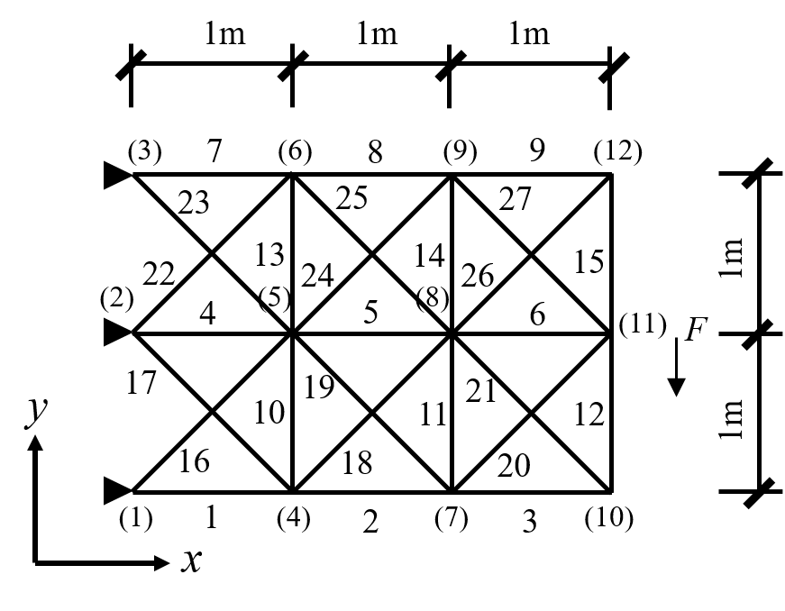

  Geometry and topology optimization of truss-like structures is one of the standard topics in structural optimization, and has received considerable attention in the past. Generally, optimization of truss-like structures can be classified into three categories; namely, sizing, geometry (or shape) and topology optimization. Among them, sizing optimization, which aims at finding the optimal cross-sectional properties of members, is commonly included in geometry and topology optimization, and the change of structural topology can be achieved in the standard framework of sizing optimization problem.  
  <figure class="half" style="display:flex; align-items: flex-end">
     
  </figure>
  

    <b>FIG.1:</b> Initial structure of numerical example
  

   
  When geometry optimization is involved, one of the main challenges is the existence of melting nodes, or coalescent nodes, resulting in extremely short member in the structure and making the stiffness matrix singular. In order to alleviate this diffculty, the force density method (FDM) is introduced for shape optimization which indirectly controls the member length. A numerical example with initial structure shown in Fig.1 is investigated the effectiveness of the proposed method, and the optimization procedure shown in Fig.2 shows that a reasonble optimal result can be obtained by introducing FDM for determining the structural shape, where the red and blue lines indicate the positive and negative force density values, respectively.
  
  <figure class="half" style="display:flex; align-items: flex-end">
     
  </figure>
  

    <b>FIG.2:</b> Intermediate solutions of numerical example
  
 
   
  Moreover, many researches have been proposed to consider uncertainty in structural optimization, such as robust optimization, reliability-based optimization and the worst-case design, and I am also working on this research topic right now. Although incorporating uncertainty into structural optimization is not a trival task, I would like to keep my research interest on this area with following directions 
<ul>
  <li> non-probabilistic model based/sample-based structural optimization under uncertainty</li>
  <li> nonlinear/dynamic structural optimization under uncertainty </li>
  <li> combining machining-learning technique with robust/reliability-based optimization</li>
</ul>  

  

