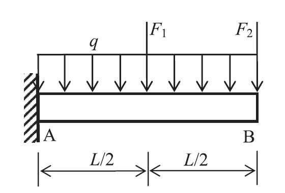

  I began to learn and study reliability analysis when I was a master student. The reliability analysis of an engineering system or component is typically based on a model that describes structural response $ Y $ as a function of basic random $ \boldsymbol{X} $ variables, which can be given mathematically
  
  \begin{equation} \small  
  Y = f \left ( \boldsymbol{X} \right )
  \tag{1}
  \end{equation}
  
  The probability of failure $ P_{f} $ is defined as the probability of structural response being in a domain of unacceptable operation, such as response exceeding a critical threshold, $ y_{c} $, and it is typically defined in terms of a limit state function

  \begin{equation} \small
  g \left ( \boldsymbol{X} \right ) = y_{c} - f \left ( \boldsymbol{X} \right ) \quad
  {\rm such\ that}\ P_{f} = {\rm Pr}\left [ g \left ( \boldsymbol{X} \right ) \leq 0 \right ]
  \tag{2}
  \end{equation}
  
  There are a number of reliability analysis method, like Monte Carlo simulation (MCS)[1],first-order reliability method (FORM)[2],second-order reliability method[3] and the moment methods[4]. One of the main challenges is to balance the accuracy and efficiency of the reliability analysis, that is
  <ul>
    <li> minimize the function evaluations </li>
    <li> find the most appropriate probability distribution or explicit approximation of the implicit limt state function </li>
  </ul>
  To achieve this goal,a polynomial response surface method with adapative bivariate dimensional reduction method is proposed in which a criteria is introduced to eliminate the unnecessary quadratic term in response surface function [5]. In this way the efficiency could be enhanced without great loss of accuracy. An numerical example of cantilever beam, which is shown in Fig.1, is used to investigated the effectiveness of proposed method. The limit state function is defined as the displacement of point B is equal to 15mm in vertical direction and the limit state function is then formulated  as [7]
  \begin{equation} \small
  g \left (q,F_1,F_2,E \right )=15 - \frac{qL^4}{8EI}-\frac{5 F_1 L^3}{48EI} - \frac{F_2 L^3}{3EI}
  \tag{3}
  \end{equation}

  <figure class="half" style="display:flex; align-items: flex-end">
     
  </figure>
  

    <b>FIG.1:</b> The model of numerical example
  

   
  and the results obtained by MCS, proposed method, RSM with only quadratic term (QP) and complete quadratic term (CQP) are shown in Table 1,where $ \beta,\ k_final,\ and\ N  $ is the Hasofer-Lind Rackwitz-Fiessler(HL-RF) reliability index, the number of iterations and function evaluations. It can be observed that the proposed method is able to obtain accurate result with less function evaluations

 
 

  <table border="1" cellspacing="0" frame=void rules = all>
    <tr>
      <td align="center" width = "200" > Method </td>
      <td align="center" width = "200" > $ k_{final} $ </td>
      <td align="center" width = "200" > $ N $ </td>
      <td align="center" width = "200" > $ \beta $ </td>
      <td align="center" width = "200" > Error(%) </td>
    </tr>
    <tr>
      <td align="center" width = "200" > MCS </td>
      <td align="center" width = "200" > -- </td>
      <td align="center" width = "200" > $ 10^7 $ </td>
      <td align="center" width = "200" > 2.725 </td>
      <td align="center" width = "200" > -- </td>
    </tr>
    <tr>
      <td align="center"> RSM with QP </td>
      <td align="center"> 3 </td>
      <td align="center"> 23 </td>
      <td align="center"> 2.710 </td>
      <td align="center"> 0.6 </td>
    </tr>
    <tr>
      <td align="center"> RSM with CQP </td>
      <td align="center"> 3 </td>
      <td align="center"> 39 </td>
      <td align="center"> 2.619 </td>
      <td align="center"> 3.9 </td>
    </tr>
    <tr>
      <td align="center"> proposed method </td>
      <td align="center"> 3 </td>
      <td align="center"> 25 </td>
      <td align="center"> 2.710 </td>
      <td align="center"> 0.6 </td>
    </tr>
  </table>

  However, the method only consider component reliability analysis within linear elasticity case. In the future I would like to dig more about structural reliability analysis in system or dynamic case.

   
  Reference  
  [1]  
  [2]  

 

