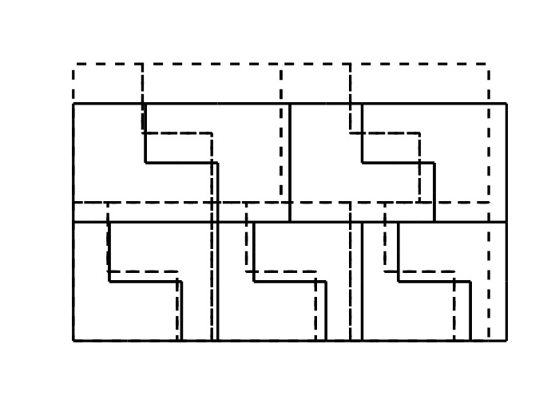
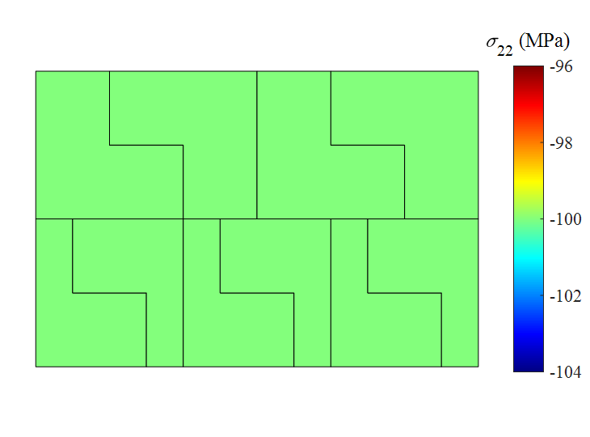

  Virtual element method (VEM), which is recently proposed by L. Beirão da Veiga [1], is well-developed since its birth and becomes a powerful tool in the field of computational mechanics. Different from classical finite element method (FEM), VEM has the following features
  <ul>
  <li> VEM can be applied to arbitrary polygonal mesh </li>
  <li> VEM is able to handle hanging nodes on element edge </li>
  </ul>  
A number of researches are implemented to  exploit the effectiveness and application of VEM, including elastic analysis [2], finite deformation analysis[3], contact analysis [4], fracture analysis [5] and structural topology optimization [6]. Based on Ref. [4], the study contact analysis with non-matching contact interface by using second-order VEM is investigated as in Fig.1. The results in Fig.2 show that even with irregular element shape and non-matching interface the patch test is also passed without biased stress distribution along the contact interface.

<figure class="half" style="display:flex; align-items: flex-end">
   
   
</figure>
  

    <b>FIG.1:</b> Model of Example 1; (left) Geometry models of two elastic blocks, (right) Second-order VEM discretization
  

<figure class="half" style="display:flex; align-items: flex-end">
   
   
</figure>
  

    <b>FIG.2:</b> Results of patch test; (left) Deformed shape, (right) Stress contour of $ \sigma_{22} $
  

  
There are still a lot more fascinating and interesting properties of VEM to be explored, and right now I would like to dig more on VEM in the areas of structural topology optimization and nonlinear and multiscale analysis. 

 
Reference  
[1] <a href="https://www.worldscientific.com/doi/abs/10.1142/S0218202512500492" target="_blank" rel="noopener noreferrer">L. Beirão da Veiga, F. Brezzi, A. Cangiani, G. Manzini, L.D. Marini, A. Russo, Basic principles of virtual element methods, Math. Model. Methods Appl. Sci. 23 (2013) 199–214.</a>  
[2] <a href="https://epubs.siam.org/doi/10.1137/120874746" target="_blank" rel="noopener noreferrer">L. Beirão da Veiga, F. Brezzi, L.D. Marini, Virtual elements for linear elasticity problems, SIAM J. Numer. Anal. 51 (2013) 794–812.</a> 
[3] <a href="https://www.sciencedirect.com/science/article/pii/S0045782516309094?via%3Dihub" target="_blank" rel="noopener noreferrer">H. Chi, L.B. da Veiga, G.H. Paulino, Some basic formulations of the virtual element method (VEM) for finite deformations, Comput. Methods Appl. Mech. Eng. 318 (2017) 148–192.</a> 
[4] <a href="https://link.springer.com/article/10.1007%2Fs00466-016-1331-x" target="_blank" rel="noopener noreferrer">P. Wriggers, W.T. Rust, B.D. Reddy, A virtual element method for contact, Comput. Mech. 58 (2016) 1039–1050.</a>  
[5] <a href="https://www.sciencedirect.com/science/article/abs/pii/S0045782518302664?via%3Dihub" target="_blank" rel="noopener noreferrer">V.M. Nguyen-Thanh, X. Zhuang, H. Nguyen-Xuan, T. Rabczuk, P. Wriggers, A virtual rlement method for 2D linear elastic fracture analysis, Comput. Methods Appl. Mech. Eng. 340 (2018) 366–395.</a> 
[6] <a href="https://link.springer.com/article/10.1007%2Fs00158-019-02268-w" target="_blank" rel="noopener noreferrer">H. Chi, A. Pereira, I.F.M. Menezes, G.H. Paulino, Virtual element method (VEM)-based topology optimization: an integrated framework, Struct. Multidiscip. Optim. 62 (2020) 1089–1114.</a> 

 

