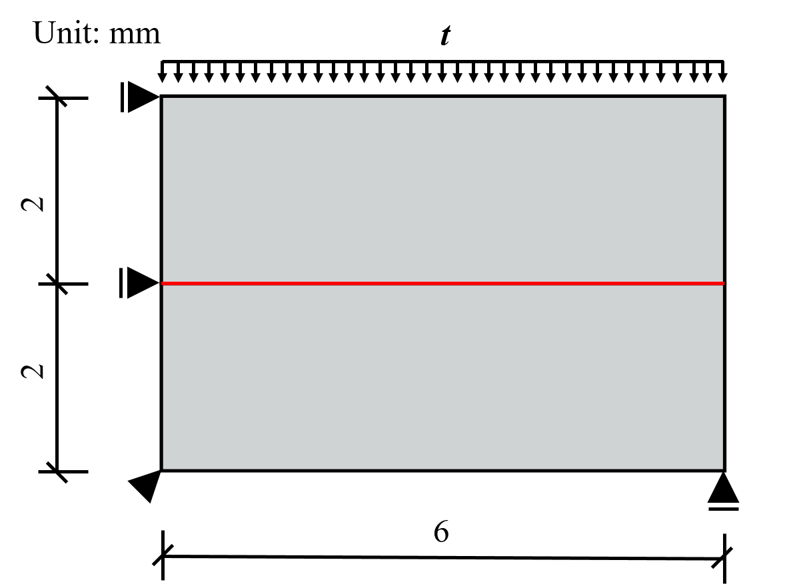
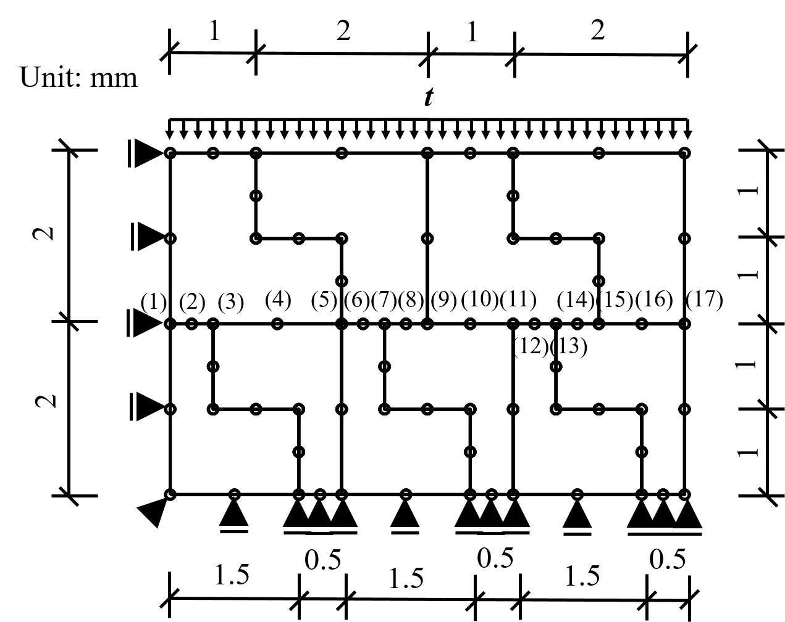

  Virtual element method (VEM), which is recently proposed by L. Beirão da Veiga [1], is well-developed since its birth and becomes a powerful tool in the field of computational mechanics. Different from classical finite element method (FEM), VEM has the following features
  <ul>
  <li> VEM can be applied to arbitrary polygonal mesh </li>
  <li> VEM is able to handle hanging nodes on element edge </li>
  </ul>  
A number of researches are implemented to  exploit the effectiveness and application of VEM, including elastic analysis [2], finite deformation analysis[3], contact analysis [4], fracture analysis [5] and structural topology optimization [6]. Based on Ref. [4], the study contact analysis with non-matching contact interface by using second-order VEM is investigated. The results show that even with irregular element shape and non-matching interface, the patch test is passed as shown in Figs.1-2. Moreover, and the accuracy of the VEM is also satisfied when compared to the results obtained by ABAQUS as shown in Fig.2.

  
  
  

  

 
